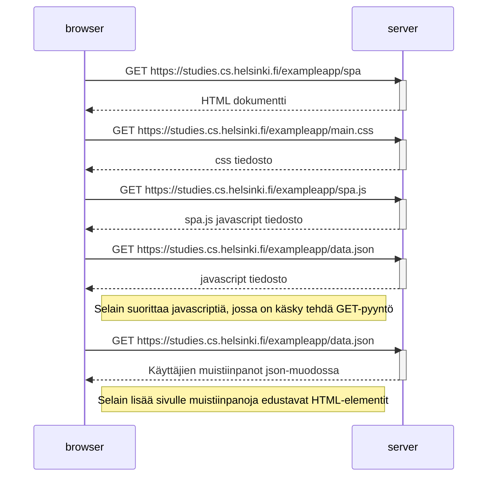

```mermaid
 sequenceDiagram
    participant browser
    participant server
    
    browser->>server: GET https://studies.cs.helsinki.fi/exampleapp/spa

    activate server
    server-->>browser: HTML dokumentti
    deactivate server
    
    
    browser->>server: GET https://studies.cs.helsinki.fi/exampleapp/main.css
    activate server
    server-->>browser: css tiedosto
    deactivate server

    browser->>server: GET https://studies.cs.helsinki.fi/exampleapp/spa.js
    activate server
    server-->>browser: spa.js javascript tiedosto
    deactivate server
    
    browser->>server: GET https://studies.cs.helsinki.fi/exampleapp/data.json
    activate server
    server-->>browser: javascript tiedosto
    deactivate server
    
    Note right of browser: Selain suorittaa javascriptiä, jossa on käsky tehdä GET-pyyntö
    
    browser->>server: GET https://studies.cs.helsinki.fi/exampleapp/data.json
    activate server
    server-->>browser: Käyttäjien muistiinpanot json-muodossa
    deactivate server    
    Note right of browser: Selain lisää sivulle muistiinpanoja edustavat HTML-elementit
```